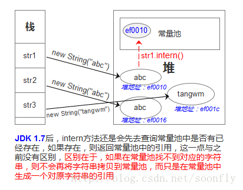

[toc]
# Java 面试复习内容

> 看见同事们都很优秀，想想也的记录一下。
> 复习笔记，可以将一个个的知识点连成线，最后组成一个个的知识面形成一套完整的知识体系，对我以后的面试或者工作都会有很大的帮助。所以打算每天争取更新一点，顺便练习一下markdown的语法规则；
     


##Java 基础知识

####面向对象
**面向对象的三个特征**

```封装，继承，多态```不需要过多解释
在代码中实现`多态`有一下三种方式：
```
接口实现； 
继承父类的重写方法； 
在同一类中进行方法重载；
```

**接口的意义**
```
 规范，扩展，回调
```

**抽象类的意义**

```
 1.为其他子类提供一个公共的类型；
 2.封装子类中重复定义的内容
 3.定义抽象方法，子类虽然不同实现，但是定义时一致
```

| 比较 | 抽象类 | 接口 |
| --- | --- | --- |
| 默认方法 | 抽象类有默认方法 | 接口在JDK8之前没有默认方法；  |
| 实现方式 | 子类使用`extends`来继承抽象类，如果子类不是抽象类，则需要子类实现抽象类中声名的抽象方法 | 使用`implements`来实现接口声明的所有方法 |
| 构造器 | 抽象类中可以有构造器 | 接口中不能 |
| 和类的区别 | 抽象类不能被实例化 | 是`interface` 不是`class` |
| 访问修饰符 | 可以有`public`,`protected`,`default`修饰 | 必须全部都是`public` |
| 多继承 | 子类只能继承一个抽象类 | 可以实现多个接口 |
| 添加新方法 | 抽象类中添加新方法可以提供默认实现，子类代码无需修改 | 接口添加新方法，子类必须实现新的方法，否则变异报错 |

**Q:父类的静态方法能否被子类重写**
父类的静态方法不能被子类重写，只能叫`隐藏`父类的静态方法；重写只适用于`实例方法`，而不适用于`静态方法`；

**Q:什么是不可变对象**
不可变对象是指一点被创建，状态就不能再被改变。任何修改都会创建一个新的对象，如String，Integer及其其他包装类；

**Q:静态变量和实力变量的区别**
静态变量存储在`方法区`属于类的的所有；
实力变量存在`堆`需要实例化才能访问，其引用存储在当前的线程栈中;

**常见的创建对象的方式有哪些**
1.通过new
2.通过反射
3.通过clone
4.通过序列化机制
`前面两个都是显式的调用了new 关键字，解耦必定减少new的使用`

**Q:String中的intern方法**
`intern()`在调用后会在常量池中查找是否存在，如果存在直接返回，不存在则在常量池中创建；

```Java
 String s1 = "abc";
 String s2 = s1.intern();
 System.out.println(s1==s2);//true
```


***另一种情况***

```Java
String str2 = "SEUCalvin";
String str1 = new String("SEU")+ new String("Calvin");

System.out.println(str1.intern() == str1);//fasle;

System.out.println(str1 == "SEUCalvin");//false;

System.out.println(str2 == str1.intern());//true;
```


JDK1.7 intern()方法作用在上图的红字部分和1.6有区别；


***Object中有哪些公共方法***
1.equals();
2.clone();
3.getclass();
4.notify(),notifyAll(),wait();
5.toString();

```
其中关于‘equals’ 和 ‘==’
前者是值比较；
后者是引用地址比较；
如果是简单类型 ==也是值比较；
```

//TODO 
[后续内容](https://mp.weixin.qq.com/s?__biz=MzI0MjQxNjAyOQ==&mid=2247484572&idx=2&sn=6c8ca4e5bd1f5d068f8a888896f2e67d&chksm=e97de46ede0a6d78a44cfde9e58df50219c4ab63271c0bba5da2cd3da3874ebd1f342ba0bdf0&scene=0&key=9387a1ed96c97cc054994b47b3b5f38202477d39c0ee645d23cadc30106d2df0ce881d8cb6b4ba5a747acac69fb3b72161131cd2d8046d26f7b429669e3a0e424ff6bab7503f9546a37fd87734a5f2b4&ascene=0&uin=MTUyMTQ5OTc1&devicetype=iMac+MacBookPro14%2C1+OSX+OSX+10.13.1+build(17B1003)&version=12020810&nettype=WIFI&lang=zh_CN&fontScale=100&pass_ticket=Y2v9Fk7gih3uNztr72UyUqPDTpUqTfvK0bwunyyGN1U%3D)


####集合
####泛型
####JVM内存模型
####多线程
####锁
####反射

## Java 开发内容
####spring 框架
####redis
####mq队列
####tomcat


